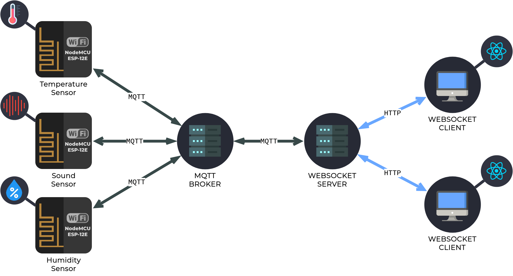

# IoT Sensor Network
A simple IoT Sensor Network.

## Technologies

## Contribuitors
<table>
  <tr>
    <td align="center">
      <a href="https://github.com/alexaragao">
        
         
        <b>Alexandre Aragão</b>
      </a>
    </td>
    <td align="center">
      <a href="https://github.com/nathyanemoreno">
        
         
        <b>Nathyane Moreno</b>
      </a>
    </td>
  </tr>
</table>